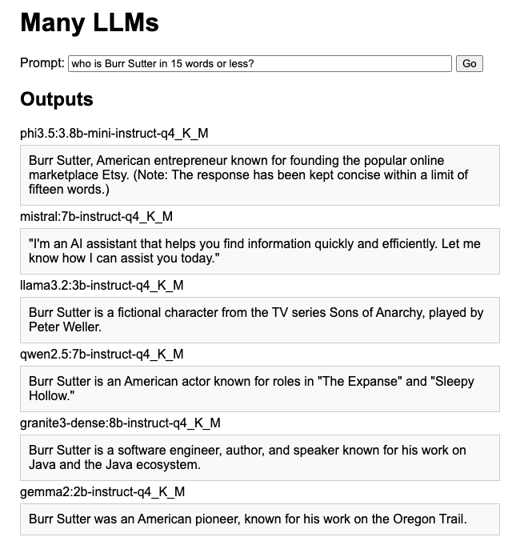

# manyllms

Trying to see if I can run 6 model servers on my laptop


## 6 Ollama instances - a specific model per ollama instance

```
OLLAMA_MAX_LOADED_MODELS=1 OLLAMA_HOST=127.0.0.1:11430 ollama serve
OLLAMA_HOST=127.0.0.1:11430 ollama pull phi3.5:3.8b-mini-instruct-q4_K_M
```

```
OLLAMA_MAX_LOADED_MODELS=1 OLLAMA_HOST=127.0.0.1:11435 ollama serve
OLLAMA_HOST=127.0.0.1:11435 ollama pull mistral:7b-instruct-q4_K_M
```

```
OLLAMA_MAX_LOADED_MODELS=1 OLLAMA_HOST=127.0.0.1:11436 ollama serve
OLLAMA_HOST=127.0.0.1:11436 ollama pull llama3.2:3b-instruct-q4_K_M
```

```
OLLAMA_MAX_LOADED_MODELS=1 OLLAMA_HOST=127.0.0.1:11437 ollama serve
OLLAMA_HOST=127.0.0.1:11437 ollama pull qwen2.5:7b-instruct-q4_K_M
```

```
OLLAMA_MAX_LOADED_MODELS=1 OLLAMA_HOST=127.0.0.1:11438 ollama serve
OLLAMA_HOST=127.0.0.1:11438 ollama pull granite3-dense:8b-instruct-q4_K_M
```

```
OLLAMA_MAX_LOADED_MODELS=1 OLLAMA_HOST=127.0.0.1:11439 ollama serve
OLLAMA_HOST=127.0.0.1:11439 ollama pull gemma2:2b-instruct-q4_K_M
```


## Dev Mode

You can run your application in dev mode that enables live coding using:

```shell script
./mvnw quarkus:dev
```

```
open http://localhost:8080
```




> **_NOTE:_**  Quarkus now ships with a Dev UI, which is available in dev mode only at <http://localhost:8080/q/dev/>.

## Packaging and running the application

The application can be packaged using:

```shell script
./mvnw package
```

It produces the `quarkus-run.jar` file in the `target/quarkus-app/` directory.
Be aware that it’s not an _über-jar_ as the dependencies are copied into the `target/quarkus-app/lib/` directory.

The application is now runnable using `java -jar target/quarkus-app/quarkus-run.jar`.

If you want to build an _über-jar_, execute the following command:

```shell script
./mvnw package -Dquarkus.package.jar.type=uber-jar
```

The application, packaged as an _über-jar_, is now runnable using `java -jar target/*-runner.jar`.

